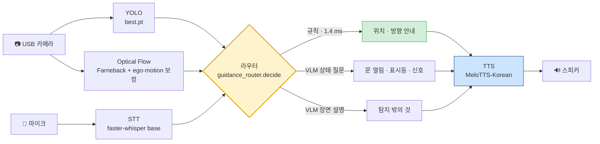

<div align="center">

# 👁️ VIAssist — 아이즈온(Eyes-On)

**시각장애인 보행 보조 웨어러블의 온디바이스 파이프라인**

NVIDIA Jetson Orin Nano 8GB **한 대**에서 탐지·방향 판정·음성 안내를 전부 돌린다.<br>
클라우드 없이, 통합 메모리 7.6 GB 안에서.

<br>


</div>

---

## ⚡ 한눈에 보기

| | |
|---|---|
| **하는 일** | 카메라로 시설물을 찾고, 움직이는 방향을 판정하고, 물어보면 말로 답한다 |
| **도는 곳** | Jetson Orin Nano 8GB 한 대 — 온디바이스, 네트워크 불필요 |
| **규칙 안내** | **1.4 ms** — 위치·방향은 VLM 없이 즉답 |
| **VLM 안내** | **0.62 s** — SmolVLM-500M Q8 · llama.cpp |
| **음성 왕복** | 말 끝 → 텍스트 **1.3 s**, 이후 첫 문장부터 바로 재생 |
| **전체 스택 메모리** | ≈ 6,000 MB / 7,607 MB (여유 ≈ 1.3 GB) |
| **개발자 도구** | `/test` 모듈 점검 대시보드 — 10개 탭에서 모듈을 따로 확인 |

---

## 🧭 목차

- [파이프라인](#-파이프라인)
- [저장소 구성](#-저장소-구성)
- [젯슨에서 실행](#-젯슨에서-실행)
- [웹 화면](#%EF%B8%8F-웹-화면)
- [라우터 규칙](#-라우터-규칙)
- [실측 수치](#-실측-수치)
- [안정성 — 꼭 읽을 것](#%EF%B8%8F-안정성--꼭-읽을-것)
- [테스트](#-테스트)
- [관련 문서](#-관련-문서)

---

## 🔀 파이프라인



<details>
<summary>텍스트 버전 (Mermaid가 안 보일 때)</summary>

```
USB 카메라 ─┬─ YOLO(best.pt) ────────────────────────────┐
            └─ Optical Flow(Farneback + ego-motion 보정) ─┤
                                                         ▼
마이크 ── STT(faster-whisper) ── 질문 ──▶ 라우터 ──▶ 규칙 안내(0 ms) ─────────┐
                                             ├──▶ VLM 상태 질문(문 열림·표시등)  ├──▶ TTS(MeloTTS) ──▶ 스피커
                                             └──▶ VLM 장면 설명(탐지 밖의 것)  ┘
```

</details>

---

## 📁 저장소 구성

### `mvp/` — 젯슨에서 도는 메인 스택

| 파일 | 내용 |
|---|---|
| `escalator_mvp.py` | **메인 서버(Flask :5000).** 카메라 스레드, YOLO+Flow 처리 루프, `/status` `/video_feed` `/guide` `/vlm/*` |
| `guidance_router.py` | **규칙 / VLM 상태 / VLM 장면** 자동 분기. `/guide/auto`, `/guide/decide` |
| `class_rules.py` | 클래스 33개의 한국어 이름·문장 형태·히스토리 길이. 규칙 안내 템플릿. detection 표기 정규화 |
| `background_motion.py` | 카메라 자체 움직임(ego-motion) 제거 — 배경 특징점 homography, 실패 시 중앙값 폴백 |
| `perception_payload.py`<br>`motion_log.py` | Perception 계약(§4) payload 생성, 모션 로그 |
| `stt_service.py` | faster-whisper(base, int8, CPU). VAD(침묵 650 ms에 종료), 44.1 kHz→16 kHz, 스트리밍 부분 인식, 기동 워밍업, 디코딩 상한(온도 0·64토큰) |
| `tts_service.py`<br>`melo_worker.py` | MeloTTS-Korean(CUDA, `~/melo_env` 별도 프로세스) + gTTS 폴백. **문장 단위 청킹** — 첫 문장이 나오면 바로 재생, 다음 문장은 재생 중 합성. 문장 단위 캐시 |
| `voice_endpoints.py` | `/voice/listen` `/voice/stream` `/voice/say` `/voice/ask`(기본 `mode=auto` → 라우터) |
| `vlm_bridge.py`<br>`failure_notice.py`<br>`slot_schema.py` | VLM 파이프라인 연결(유휴 언로드/재로드 옵션 `VLM_IDLE_UNLOAD_S`, 기본 꺼짐), 실패 사유 안내, 슬롯 프롬프트 |
| `module_test.py`<br>`module_test.html` | **모듈 점검 대시보드** `/test` |
| `tests/` | 모듈 단위 테스트 |

### `vlm/` — VLM 파이프라인

엔진 셋 세 가지. 기본은 **llama.cpp**다.

| 엔진 | 구현 | config |
|---|---|---|
| **`llamacpp`** (기본) | `src/llamacpp_engine.py` — llama-server를 자식 프로세스로 띄움 | `config/jetson_llamacpp.json` |
| `local` | HF transformers SmolVLM | `config/jetson.json` |
| `gemini` | 클라우드 | `config/gemini.json` |

`src/`(config·프롬프트·안전 규칙·결과 파서), `samples/`, `tests/`, `docs/`.

VLM 출력은 **Safety Validator를 통과한 `message`만** 사용자 안내로 나간다. 객체·위치의 source of truth는 YOLO,
움직임·방향은 Optical Flow이며, 검증에 실패하면 모델을 다시 부르지 않고 metadata만 쓰는 결정적 fallback 문장으로 교체한다.
자세한 정책은 [`vlm/README.md`](vlm/README.md).

### 그 외

| 경로 | 내용 |
|---|---|
| `docs/` | 중간보고서, Perception 연동 계약, 연동 현황 |
| `scripts/jetson_setup.sh` | 시스템 안정화 1회 설정(sudo) — earlyoom, journald 영속화, 25W 전원 모드 |
| `scripts/launch_mvp.sh` | 전체 스택 재기동 런처 — 세션 분리, 로그 `~/mvp_server.log` |

> **추적하지 않는 것** (`.gitignore`): 모델 가중치(`*.pt` `*.engine` `*.onnx`), `vlm/.venv`, `vlm/.env`(API 키),
> `mvp/reports/`(벤치·오류 기록·영상), 로그. 실험·벤치 코드는 젯슨 `~/han/archive_2026-09-05/`에 보관(목록 `MOVED.txt`).

---

## 🚀 젯슨에서 실행

**전제** — JetPack(L4T R36.5.2), Python 3.10, torch 2.3.0(CUDA 12.6), ultralytics, transformers 4.49, faster-whisper,
`~/melo_env`(MeloTTS 전용 venv), `mvp/best.pt`(팀 학습 YOLO). VLM 의존성은 `vlm/requirements-jetson.txt`.

```bash
# 0) 처음 한 번 — 시스템 안정화(earlyoom·journald 영속화·25W)
sudo bash scripts/jetson_setup.sh

# 1) 전체 스택(YOLO+Flow+VLM+STT+TTS+대시보드) — 기동 약 2분 (VLM 30 s + 음성 60 s)
bash scripts/launch_mvp.sh
#    세션과 분리해 띄우고 ~/mvp_server.log 에 로그. 끝나면 /test 주소를 찍어준다.
```

<details>
<summary><b>런처를 안 쓰고 직접 띄울 때</b></summary>

```bash
cd mvp && python3 escalator_mvp.py --enable-voice --enable-vlm --stt-model base \
    --vlm-config ../vlm/config/jetson_llamacpp.json --port 5000
```

`--vlm-config`의 **CLI 기본값은 아직 `jetson.json`(HF)** 이다. llama.cpp로 돌리려면 위처럼 명시해야 한다.
런처(`scripts/launch_mvp.sh`)는 `jetson_llamacpp.json`을 기본으로 넘긴다.

**주요 옵션**

| 옵션 | 뜻 |
|---|---|
| `--model` | YOLO 가중치 (기본 `best.pt`) |
| `--camera N` · `--conf 0.45` · `--imgsz 640` | 카메라 번호 · 신뢰도 · 입력 크기 |
| `--yolo-every 3` | 3프레임마다 추론 |
| `--flow-width 320` | Flow 계산 해상도 |
| `--direction-history` · `--direction-majority` | 방향 안정화 |
| `--stt-model {tiny,base,small}` | STT 모델 크기 |
| `--tts-engine {melo,gtts}` | TTS 엔진 |
| `--vlm-timeout` | VLM soft timeout(초) |

런처 환경변수: `VLM_CONFIG` · `TTS_ENGINE` · `STT_MODEL` · `PORT` · `VLM_IDLE_UNLOAD_S`.

</details>

- `--enable-vlm` / `--enable-voice`를 빼면 해당 모듈 없이 뜬다 — 카메라+YOLO+Flow만 쓰면 메모리 0.9 GB.
- **카메라가 없어도 서버는 뜬다** (`camera_ok=false`). 대시보드 **영상 입력** 탭에서 녹화 mp4를 카메라 대신 주입해 같은 파이프라인을 돌릴 수 있다.

---

## 🖥️ 웹 화면

| 주소 | 화면 |
|---|---|
| `http://<젯슨>:5000/` | 기존 MVP 화면 — 스트림, 방향, VLM 버튼, 말로 물어보기 |
| `http://<젯슨>:5000/test` | **모듈 점검 대시보드** |

<details open>
<summary><b>대시보드 탭 10개</b></summary>

<br>

| 탭 | 확인할 수 있는 것 |
|---|---|
| 🧩 개요 | 5모듈 상태 배지, 통합 DRAM/CUDA/스왑/온도, 처리 스레드 생존 |
| 🎞️ 영상 입력 | mp4 업로드·재생·구간 이동, 카메라 ↔ 영상 전환, 방향 판정 타임라인 |
| 🎯 YOLO | 박스 스트림, 클래스·신뢰도·FPS·추론 ms, 이미지 업로드 추론 |
| 🌊 Optical Flow | 벡터 시각화 스트림, dy·magnitude·ego 보정 상태, flow 계산 시간 |
| 🧠 VLM | 현재 프레임 캡처 → 장면 설명/상황 안내, 응답 원문·지연, **설정별 벤치 이력**(파일 저장) |
| 🎤 STT | 마이크 레벨, VAD/고정 녹음, 파형·인식 텍스트, wav 업로드 인식 |
| 🔊 TTS | 문장 합성 → 브라우저 청취, 젯슨 스피커 재생, 캐시 여부 |
| ⏱️ 파이프라인 시간 | 한 번 실행하며 단계별 ms 워터폴 + **라우터가 고른 경로·이유** |
| 🚨 오류 | 라우트 예외·로거 ERROR·스레드 예외·브라우저 JS 오류를 traceback과 함께 영구 기록(`reports/module_test_errors.jsonl`) |
| 📜 로그 | 최근 로그 링버퍼 |

</details>

---

## 🧠 라우터 규칙

`guidance_router.decide` — 질문과 탐지 스냅샷을 보고 경로를 고른다.

| # | 조건 | 경로 |
|:--:|---|---|
| **0** | 질문이 **시연용 고정 응답 패턴**과 맞음 | 🎬 `scripted` — 탐지·VLM과 무관하게 정해진 문장 |
| 1 | 질문에 상태 단어(열렸/작동/표시/글자/상행/하행…) | 🧠 **VLM 상태 질문** — YOLO 컨텍스트 첨부 |
| 2 | 질문에 탐지된 시설의 이름 — "에스컬레이터 어디야" | ⚡ **규칙** — 위치·방향을 0 ms로 답함 |
| 3 | 장면·주변·위험을 묻는 열린 질문 | 🧠 **VLM 장면 설명** |
| 4 | 질문 없음 · "안내해줘" | 최우선 탐지가 `signal`(문 상태·표시등·신호등)이면 VLM 상태 질문,<br>다른 클래스면 규칙, 탐지 없으면 VLM 장면 설명 |
| 5 | VLM 비활성 | 항상 규칙 |

> [!IMPORTANT]
> **0번은 시연용이다.** `SCRIPTED_ANSWERS`에 등록된 패턴(현재 "출구 어디 있어" 계열 1건)이 들어오면
> 실제 인식 결과와 무관하게 고정 문장을 말하고, 진짜 처리처럼 보이도록 `delay_s`만큼 기다린다.
> 응답의 `route`가 `scripted`로 실려 대시보드에서 구분된다. **실측 결과가 아니다.**

실측(젯슨, SmolVLM) — 규칙 **1.4 ms**, VLM **4~5 s**(HF) / **0.62 s**(llama.cpp).
응답에 `route`/`reason`이 실려 대시보드 **파이프라인 시간** 탭에서 확인할 수 있다.

---

## 📊 실측 수치

<sub>2026-09-05 · Orin Nano 8GB</sub>

### 메모리 — 통합 DRAM 7,607 MB (GPU 가중치도 같은 예산)

| 구성 | 사용(누적) | 여유 |
|---|--:|--:|
| OS·기본 서비스 | 1,293 MB | 6,088 MB |
| ＋ YOLO + Optical Flow | 2,184 MB | 5,198 MB |
| ＋ STT + TTS (MeloTTS 워커 ≈ 2 GB) | 4,295 MB | 3,085 MB |
| ＋ SmolVLM-500M — **전체 스택** | **≈ 6,000 MB** | **≈ 1,300 MB** |

### VLM 후보 비교

<sub>같은 벤치 — 라벨 42장 슬롯 + 정성 44회</sub>

| 모델 | 상주 | 호출 | 생성 | 슬롯 파싱 / object / 둘 다 | 비고 |
|---|--:|--:|--:|---|---|
| SmolVLM-500M · HF transformers<br><sub>`jetson.json`</sub> | 1.7 GB | 4.3 s (MAXN)<br>9 s (25 W) | ~15 tok/s | 7% / 0% / 0% | 한국어 생성 불가 |
| 🏆 **SmolVLM-500M Q8 · llama.cpp**<br><sub>기본 `jetson_llamacpp.json`</sub> | **~0.4 GB** | **0.62 s** | **89 tok/s** | 40% / 0% / 0% | 같은 모델, 백엔드만 교체.<br>전체 스택 여유 1.3 → **2.5 GB** |
| Qwen3-VL-4B Q4_K_M · llama.cpp | 3.0 GB | 2.8 s | 16.7 tok/s | 71% / 14% / 5% | 위험 요소 환각 |
| Qwen3-VL-8B Q4_K_M · llama.cpp | 5.5 GB | 3.1~4.6 s | 11.4 tok/s | **93% / 24% / 14%** | 닫힌 상태 질문에 정확,<br>열린 위험 질문에 약함 |

- 8B는 전체 스택과 동시 적재 불가 — 5.5 GB > 여유 3.1 GB. DFloat11(무손실 70%)은 8B=12.3 GB로 통합 메모리에 불가.
- Qwen3-VL-4B를 쓰려면 MeloTTS(2.9 GB)를 못 띄운다 → `TTS_ENGINE=gtts` 필수.
- `scripts/launch_mvp.sh` 주석에는 **09-06 재측정치**가 남아 있다 — SmolVLM Q8 상주 1.1 GB, 4B 4.0 GB·4.1 s, 8B 6.2 GB. 위 표는 09-05 측정이다.

<details>
<summary><b>TTS 경량화 실험 — 전부 기각</b></summary>

<br>

| 후보 | 결과 |
|---|---|
| piper (한국어 커뮤니티 음성) | 343 MB · 0.7 s — **음절 14% 탈락으로 기각** |
| MMS-TTS-kor int8 (CPU) | 11~15 s — **기각** |
| MMS-TTS-kor fp32 (GPU·인프로세스) | +1.4 GB · 0.5~0.7 s |

벤치 스크립트와 결과는 젯슨 `~/vlm8b/`.

</details>

---

## ⚠️ 안정성 — 꼭 읽을 것

> [!CAUTION]
> 젯슨은 **microSD 루트, zram 스왑(RAM 안), 전원 모드 MAXN_SUPER** 상태였고 **2026-09-05 하루 4번 완전 정지**했다.
> 메모리가 바닥나면 OOM 킬러가 나서기 전에 zram 압축 스래싱으로 시스템 전체가 멈춘다 — GPU 매핑 메모리는 스왑이 안 된다.

**메모리**

- 가용 메모리 **350 MB 미만이면 VLM 호출을 차단**하는 가드가 대시보드·라우터에 있다 (`MEMORY_GUARD_MB`).
- 새 모델을 올리는 실험은 **반드시 대시보드 서버를 내린 뒤**. 여유 1.5 GB 미만이면 중단.
- 전체 스택은 VLM 추론 중 가용 메모리가 **~880 MB**까지 내려간다.
- VLM 유휴 언로드는 실측상 ~300 MB만 돌아오고 재로드(28 s) 때 더 깊이 파고들어 **기본은 꺼 두었다**.

**설정**

- `sudo bash scripts/jetson_setup.sh` 한 번 —
  `earlyoom`(메모리 5%≈380 MB에서 개입, 스왑 무시. **8%로 두면 VLM 재로드 중 서버가 죽었다**),
  `journald` 영속화(`/var/log/journal`), `nvpmodel -m 1`(25 W).
- llama.cpp 서버는 **`--cache-ram 0` 필수** — 없으면 호출마다 35 MB 누적 → OOM.
- 입력 이미지는 **크기를 고정** — 모양이 바뀌면 그래프 버퍼가 재할당된다.

**운영**

- 음성 지연 실측(09-06): 말이 끝난 뒤 침묵 0.65 s + 인식 0.6 s ≈ **1.3 s**에 텍스트.
  이전엔 온도 fallback·무제한 생성으로 2.5 s 음성에 22 s가 걸렸다. TTS는 첫 문장 합성(~0.5 s, 캐시면 1 ms)부터 소리가 난다.
- **서버 실행 중 카메라 핫플러그 금지** — 정지 사례 1회. 부팅 전에 꽂는다.
- 젯슨이 응답을 잃으면 USB-C(A-to-C) 케이블로 PC 연결 → USB 장치 모드(SSH `192.168.55.1`, 시리얼 COM, `L4T-README`)로 Wi-Fi 없이 접속 가능.
- **`pkill -f 패턴`이 자기 ssh 명령줄과 겹치면 세션이 죽는다** → 재시작은 스크립트 파일로.

---

## 🧪 테스트

카메라·CUDA·YOLO 가중치 없이 **260개**가 돈다.

```bash
# VLM 단위 + Perception adapter + mock end-to-end
cd vlm && python -m unittest discover

# MVP payload 변환 + VLMBridge mock 통합
cd mvp && python -m unittest discover -s tests -t .
```

`vlm/tests/test_perception_end_to_end.py`와 `mvp/tests/test_mvp_vlm_integration.py`가
Perception → Adapter → VLMService → Safety Validator → 최종 JSON 전 구간을 mock 엔진으로 확인한다.

---

## 📚 관련 문서

| 문서 | 내용 |
|---|---|
| [`docs/perception_integration_contract.md`](docs/perception_integration_contract.md) | Perception(YOLO/Flow) ↔ VLM payload 계약 |
| [`docs/integration_status_2026-08-15.md`](docs/integration_status_2026-08-15.md) | 연동 현황, 검증 상태, 알려진 한계 |
| [`vlm/README.md`](vlm/README.md) | VLM 안전 정책, 장면 설명 모드, 벤치·통합 실행법 |
| [`vlm/docs/`](vlm/docs) | VLM 통합 계약, 지연 최적화 기록 |
| [`docs/중간보고서.md`](docs/중간보고서.md) · `docs/2026_Edge_중간보고서.pdf` | 중간보고서 |

프롬프트 v2 설계·개발보고서 수정 체크리스트는 팀 공유 문서(2026-09-05).

---

<div align="center">
<sub>VIAssist · 아이즈온(Eyes-On)</sub>
</div>
